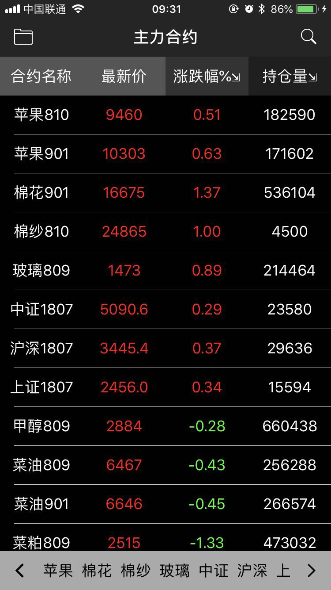
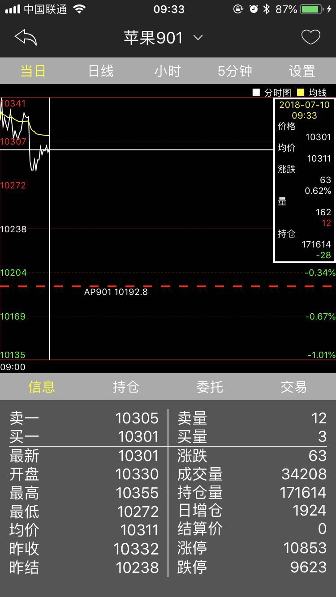
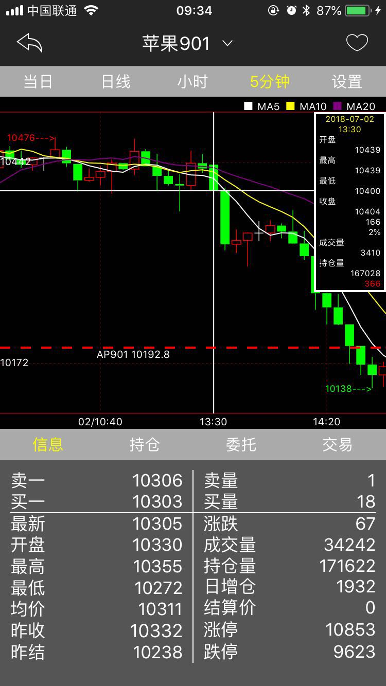

# shinny-futures-ios
一个开源的 ios 平台期货行情交易终端 
### Preview
   
### Install
- 您可以在AppStore中搜索`快期小Q`进行安装
- XCode版本：9.4
- bugly：项目中嵌入了bugly平台，具体使用见[bugly文档中心](https://bugly.qq.com/docs/)
- 下载本项目解压，在项目根目录中双击shinnyfutures.xcworkspace文件打开工程
- 选择`target`为`shinnyfutures`，钩上自动签名，`Team`选择您自己的appleID

- 由于原bundleid已被注册，您可以任意修改一下，比如加“1”

- `Command R`进行编译打包安装
- 模拟账号获取：[simnow账号注册](http://www.simnow.com.cn/)
- 提问：您可以在`issue`中给我们留言，也可以加入我们的`Diff开发交流群(611806823)`交流讨论
### Function
软件的主要功能：查看行情以及进行交易 
- 首页
    - 导航栏：完成各个交易所合约列表的切换以及不同页面的跳转
    - 合约列表显示：合约报价单显示，长按添加/删除自选
    - 账户：查看账户资金
    - 持仓：跳转到合约详情页
    - 成交：查看成交记录
    - 转账：进行银期转帐
    - 反馈：用户意见查看与反馈
    - 搜索：合约搜索
- 合约详情页
    - 当日：显示分时图
    - 日线：显示日Ｋ线
    - 小时：显示小时线
    - 5分钟：显示5分钟线
    - 设置：选择是否显示持仓线、挂单线、均线
    - 合约标题：展示自选合约列表，点击切换合约信息
    - 信息：显示合约盘口信息
    - 持仓：显示账户持仓列表
    - 委托：显示账户下单情况
    - 交易：三键下单板进行交易
### Code Architecture
#### Data
根据websocket协议进行实时数据更新
- 利用URLSession从服务器获取合约列表文件进行解析
- 利用Starscream框架分别与行情和交易服务器进行连接，获取行情数据和期货公司列表数据
- 对服务器发过来的json数据进行解析
- 数据解析完毕后利用ios消息机制进行行情数据以及交易数据的刷新
#### UI
界面由viewController、cell以及自定义view三个模块来构建
- 利用UITableView实现合约报价列表
- 利用Charts框架完成K线图的绘制
- 自定义下单软键盘
#### Framework
- [SwiftyJSON](https://github.com/SwiftyJSON/SwiftyJSON)
- [Starscream](https://github.com/daltoniam/Starscream)
- [DeepDiff](https://github.com/onmyway133/DeepDiff)
- [Bugly](https://github.com/BuglyDevTeam/Bugly-iOS)
- [Siren](https://github.com/ArtSabintsev/Siren)
